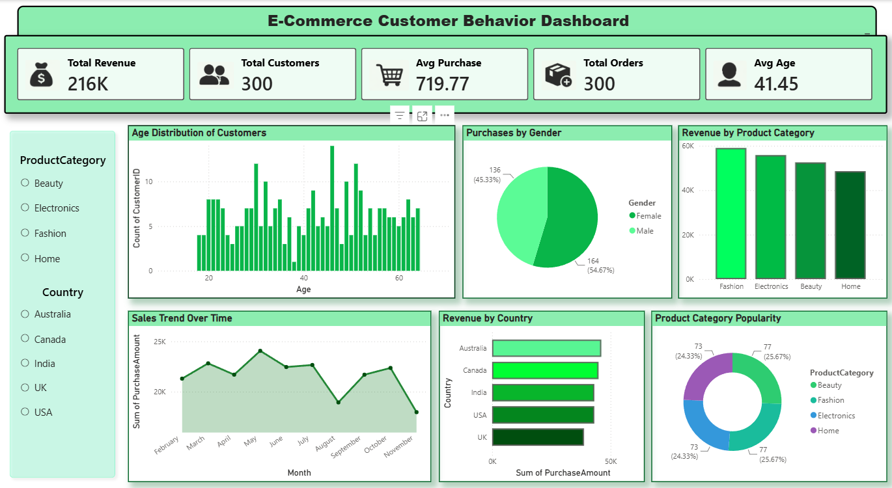

# 🛒 E-Commerce Customer Behavior Dashboard

## 📌 Project Overview

This project presents an interactive **Power BI dashboard** that analyzes customer purchasing behavior in an e-commerce business. The dashboard provides insights into customer demographics, purchasing patterns, revenue distribution, and product category performance to support data-driven business decisions.

---

## 🎯 Business Objective

The objective of this dashboard is to analyze customer purchasing behavior by answering questions such as:

- What is the total revenue generated?
- How many customers and orders were recorded?
- What is the average purchase value?
- Which product categories generate the highest revenue?
- Which countries contribute the most revenue?
- How are customers distributed by age and gender?

---

# 🛠️ Tools Used

- Microsoft Power BI
- CSV Dataset

---

# 📂 Dataset

The dataset contains customer purchasing information, including:

- Customer ID
- Age
- Gender
- Country
- Product Category
- Purchase Amount
- Order Details

---

# 📊 Dashboard Features

### KPI Cards

- Total Revenue
- Total Customers
- Average Purchase Value
- Total Orders
- Average Customer Age

### Interactive Visualizations

- Age Distribution of Customers
- Purchases by Gender
- Revenue by Product Category
- Sales Trend Over Time
- Revenue by Country
- Product Category Popularity

### Filters

- Product Category
- Country

---

# 📷 Dashboard Preview



---

# 📈 Dashboard Highlights

| KPI | Value |
|------|--------|
| Total Revenue | **216K** |
| Total Customers | **300** |
| Total Orders | **300** |
| Average Purchase Value | **719.77** |
| Average Customer Age | **41.45** |

---

# 💡 Key Insights

- Total revenue reached **216K**.
- A total of **300 customers** placed **300 orders**.
- **Fashion** generated the highest revenue among product categories.
- Female customers contributed slightly more purchases than male customers.
- **Australia** recorded the highest revenue.
- Customers are broadly distributed across the **18–65** age range.

---

# 📁 Repository Structure

```
E-Commerce-Customer-Behavior-Dashboard/
│
├── Dataset/
│   └── Ecommerce_Customer_Behavior_Dataset.csv
│
├── Dashboard/
│   └── E-Commerce Customer Behavior Dashboard.pbix
│
├── Images/
│   └── Dashboard.png
│
└── README.md
```

---

# 🚀 How to Use

1. Download or clone this repository.
2. Open the `.pbix` file using Microsoft Power BI Desktop.
3. Load or refresh the dataset if required.
4. Explore the dashboard using the interactive filters.

---

# 📚 Skills Demonstrated

- Dashboard Design
- KPI Visualization
- Interactive Reporting
- Data Visualization
- Business Intelligence
- Power BI

---

# 👨‍💻 Author

**Pranav E**

Aspiring Data Analyst

**Skills:** Power BI | SQL | Python | Excel
